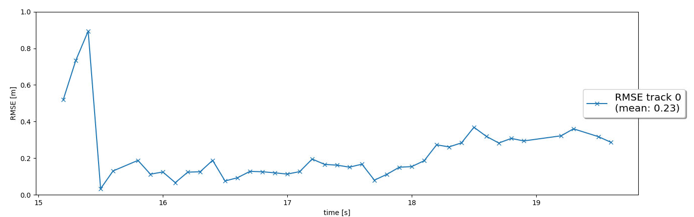
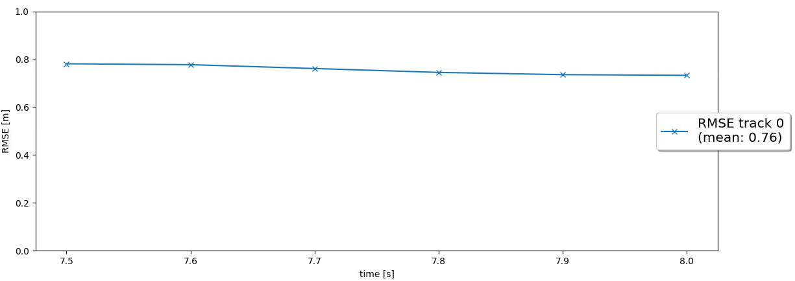
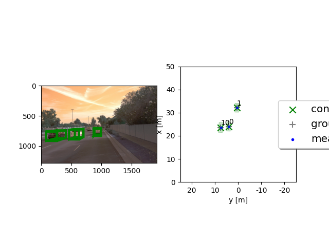
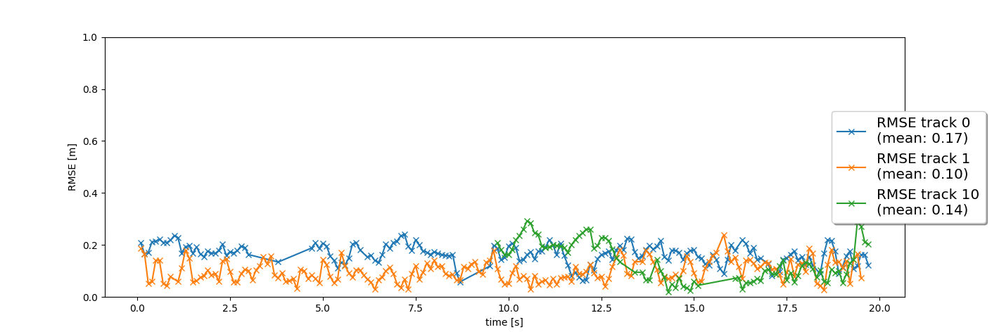

# Writeup: Track 3D-Objects Over Time

Please use this starter template to answer the following questions:

#### 1. Write a short recap of the four tracking steps and what you implemented there (filter, track management, association, camera fusion). Which results did you achieve? Which part of the project was most difficult for you to complete, and why?

## STEP - 1 - Implement an EKF
In Step 1 of the final project, implemented an EKF to track a single real-world target with lidar measurement input over time!

- In `student/filter.py`, implemented the `predict()` function for an EKF
- Implemented the `F()` and `Q()` functions to calculate a system matrix for constant velocity process model in 3D and the corresponding process noise covariance depending on the current timestep dt.
- At the end of the prediction step, resulting x and P saved by calling the functions `set_x()` and `set_P()` that are already implemented in `student/trackmanagement.py`
- Implemented the `update()` function as well as the `gamma()` and `S()` functions for residual and residual covariance by calling the functions `get_hx` and `get_H` that are already implemented in `students/measurements.py` to get the measurement function evaluated at the current state, h(x), and the Jacobian H.

## STEP - 2 - Implement the track management
Implemented the track management to initialize and delete tracks, set a track state and a track score.

- In the `Track` class, fixed track initialization values replaced by initialization of `track.x` and `track.P` based on the input `meas`, which is an unassigned lidar measurement object of type `Measurement`. Transformed the unassigned measurement from sensor to vehicle coordinates with the `sens_to_veh` transformation matrix implemented in the `Sensor` class. Initialized the track state with 'initialized' and the score with `1./params.window`, where `window` is the window size parameter, as learned in the track management lesson.

## STEP - 3 - Implement a single nearest neighbor data association
Implement a single nearest neighbor data association to associate measurements to tracks.

- In the Association class, implemented the `associate()` function
- Replaced `association_matrix` with the actual association matrix based on Mahalanobis distances for all tracks in the input `track_list` and all measurements in the input `meas_list`. Used the `MHD()`function to implement the Mahalanobis distance between a track and a measurement. Also, used the `gating()` function to check if a measurement lies inside a track's gate. 
- Updated the list of unassigned measurements `unassigned_meas` and unassigned tracks `unassigned_tracks` to include the indices of all measurements and tracks that did not get associated.

## STEP - 4 - Implement the nonlinear camera measurement model
- In the `Sensor` class, implemented the function `in_fov()` that checks if the input state vector `x` of an object can be seen by this sensor. The function should return `True` if x lies in the sensor's field of view, otherwise `False`. 
- In the `Sensor` class, implemented the function `get_hx()` with the nonlinear camera measurement function `h`
- Transformed position estimate from vehicle to camera coordinates,
- Projected from camera to image coordinates,
- In the `Measurement` class, initialized camera measurement objects including `z`, `R`, and the sensor object `sensor`

#### 2. Do you see any benefits in camera-lidar fusion compared to lidar-only tracking (in theory and in your concrete results)? 
In autonomous systems, it is certain that multiple sensors should be used to detect cars, cyclists, pedestrians robustly. Also it is certain that it will increase safety. With fusing sensor datas, it will mitigate sensor noises and detection errors. 

#### 3. Which challenges will a sensor fusion system face in real-life scenarios? Did you see any of these challenges in the project?
Extrinsics and intinsics calibraitons of sensor will highly effect the fusion results. Also finding a robust algorithm for all environments (i.e crowd places, different objects than labeled data etc.) will increase algorithm complexity.

In this project, I had a hard time while implementing kalman filter equations.

#### 4. Can you think of ways to improve your tracking results in the future?
- Fine-tune parameterization. One idea would be to apply the standard deviation values for lidar. 

- Implement a more advanced data association, e.g. Global Nearest Neighbor (GNN) or Joint Probabilistic Data Association (JPDA).

- Adapt the Kalman filter to also estimate the object's width, length, and height, instead of simply using the unfiltered lidar detections as we did.

- Use a non-linear motion model, e.g. a bicycle model, which is more appropriate for vehicle movement than our linear motion model, since a vehicle can only move forward or backward, not in any direction.
